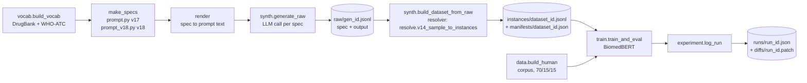
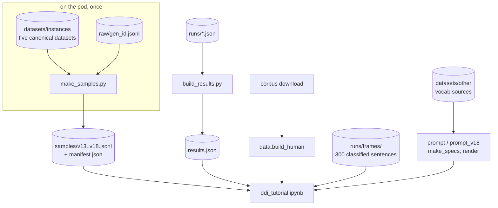

# Tutorial design and project setup

This note has two halves. The first describes how the project itself is set up, because the tutorial is built on top of it and cannot be understood or maintained without that picture. The second describes the tutorial: the principle it follows, the files it consists of, how data reaches it, what every cell does and why, and what I have and have not been able to verify. The last sections give the order in which to run things and the corrections to the record that came out of building it.

---

# Part 1: the project

## What the project is, in one paragraph

The repository asks whether an LLM can write training data for a relation extraction classifier on DDI-2013, where the label belongs to an ordered pair of drug mentions inside a sentence rather than to the sentence itself. It generates labelled sentences from structured specifications, trains BiomedBERT on them, and compares the result against the same classifier trained on the real corpus and on real sentences labelled by an LLM. Every generated dataset is written once with a manifest and a content hash, and every training run is logged with its configuration, its metrics and the uncommitted diff of the working tree at the moment it ran, so that any result can be traced back to the bytes and the code that produced it.

## Repository layout

```
ddi-synth/
  ddi/                     the package; every stage of the pipeline lives here
  scripts/                 command-line entry points for long jobs (generation, labelling, calibration)
  datasets/
    manifests/             one JSON per dataset: provenance, generator, size, label counts, sha256
    instances/             the datasets themselves                              gitignored
      raw/                 one JSONL per generation run: spec + model output    gitignored
    other/
      DrugBank.csv         drug vocabulary source                               committed
      WHO-ATC-DDD.csv      drug-group vocabulary source                         committed
  runs/
    <run_id>.json          one record per training run                          committed
    diffs/<run_id>.patch   the working-tree diff at the moment of that run      committed
    frames/                300 real corpus sentences hand-classified by construction   committed
    archive/               superseded runs, kept rather than deleted
  DDICorpusBrat/           the DDI-2013 corpus in brat format                   gitignored
  _public/                 the experiment-ledger tools (collect_runs, render_log)
  notes/, reports/, logs/, figures/
  tutorial/                everything described in part 2
```

The division between committed and gitignored is the single most important thing to understand about running anything. The code, the vocabulary, the manifests, the run records, the diffs and the hand-classified corpus sentences are all in the repository, so a fresh clone can build specifications, compute every spec-level diagnostic and read every logged result. The generated datasets and the corpus are not, so a fresh clone cannot load a dataset by id or retrain anything until those are supplied.

## Where the data lives

`DATA_ROOT` is defined in `ddi/manifest.py` as `ROOT / "datasets" / "instances"`, relative to the repository root, and `RAW` in `ddi/synth.py` is `DATA_ROOT / "raw"`. There is no separate configuration for a data location. On the pod the repository itself sits on the NFS mount at `/mnt/primary/synth_data_creation`, which is why the datasets survive pod restarts and why the manifests record `data_root` as an NFS path. On a laptop clone the same relative paths resolve to empty directories. Anything that calls `load_dataset` therefore works on the pod and fails on a laptop, and this is the reason the tutorial's sample extraction has to run on the pod once before the notebook can run anywhere.

`load_dataset(dataset_id)` reads `DATA_ROOT/<dataset_id>.jsonl`, recomputes its sha256 and refuses to return it if the hash no longer matches the manifest, so a dataset that has been edited in place since it was written cannot be silently used.

## The pipeline



A **spec** is a structured description of one sentence to be written: which drugs it must mention, which assertions it must make and which pairs they make positive, which modifiers shape its arrangement, and which variants make positive assertions impure. Because the spec says which pairs are positive, it is also the gold annotation, so labels are correct by construction rather than inferred after the fact. `render` turns a spec into prompt text and costs nothing.

`generate_raw` sends each rendered spec to the model and appends one record per spec to `raw/<gen_id>.jsonl`, flushing after every record, so a pod that dies loses only the requests in flight, and `resume=True` skips specs that already succeeded while retrying the ones that errored.

`build_dataset_from_raw` is the second stage. It reads the raw file, finds each drug in the generated text, tags every pair with `[E1]`/`[E2]` markers and assigns each its label from the spec, then writes the instances and their manifest. The split into two stages is deliberate: the first stage is expensive and non-deterministic, the second is cheap and deterministic, so whenever the resolver changes the second stage can be rerun over the existing raw output at no cost and without regenerating anything.

Training reads instances, trains BiomedBERT, reports micro-F1 over the four positive classes with NONE excluded, and `log_run` writes the run record and the diff.

## Identifiers and how they join

Four identifiers hold the system together, and the tutorial depends on the way they compose.

A **gen_id** names one generation run and one raw file, for example `v18-full`. A **spec_index** is a spec's position within that run and is stored in every raw record. A **dataset_id** names one written dataset, for example `20260825-095703-67c1fa`, and its manifest records the gen_id it came from. A **run_id** names one training run.

The instance `sent_id` is what makes old datasets diagnosable retroactively. For generated data it is `synth:<gen_id>:<spec_index>:s<n>`, where the trailing `:s<n>` distinguishes sentences when one output contains more than one. Stripping that suffix gives `synth:<gen_id>:<spec_index>`, which is exactly the key needed to find the spec that produced the sentence in `raw/<gen_id>.jsonl`. Nothing downstream ever needed to record the frame or the assertions on the instance, because they can always be recovered through this join as long as the raw file survives. Human instances use `human:<register>:<document>:s<n>` and have no spec.

## Human data

`data.build_human()` loads only the corpus's `Train` directory, splits it at document level into 70% train, 15% dev and 15% val with seed 42, splits documents into sentences with spaCy, and makes one instance per unordered pair of entities using `itertools.combinations`. The official `Test` directory is never touched by it, which is what keeps a final test evaluation clean. Development numbers throughout the project are on dev; selection is meant to happen on val; test is run once.

Two details matter for the tutorial. First, the unordered construction differs from the earlier sentence-level tutorial, which uses `itertools.product` and so makes one instance per ordered pair, twice as many. Second, a handful of enumeration sentences produce hundreds of pairs each, and the 190-pair filter used in several arms exists to remove eight sentences that carry 43% of instances.

## Environment

There is no `requirements.txt`, `pyproject.toml` or environment file in the repository, which is why environments have drifted between the pod and your laptop. The packages the code actually imports are `bioc`, `datasets`, `ipywidgets`, `matplotlib`, `numpy`, `openai`, `pandas`, `pydantic`, `requests`, `scikit-learn`, `spacy`, `torch`, `tqdm` and `transformers`, plus `accelerate` which `transformers.Trainer` requires, plus the spaCy model `en_core_web_sm`. The LLM endpoint at `api.llm.apps.os.dcs.gla.ac.uk` is university-internal and needs the VPN off campus.

`ddi/data.py` currently loads the spaCy model as a default argument, which Python evaluates at import time, so importing any module that reaches `ddi.data`, which is `synth`, `verify_binary`, `frame_diag`, `resolve` and `gold_frames`, fails without the model installed even when no sentence is ever split. `tutorial/lazy_spacy.patch` defers the load to first use. I verified that with the patch applied all six modules import with `spacy.load` disabled, and that the one call site in `build_human`, which passes the model explicitly, is unaffected.

---

# Part 2: the tutorial

## The principle

The tutorial never generates a dataset or trains a model in order to make an argument. The previous versions reimplemented the pipeline inline and regenerated toy data for each point, so every number a reader saw came from something that only resembled what it illustrated, and one cell would have printed a value that contradicted the prose around it. This version reads samples of the real generated datasets, runs the project's real spec builders, and quotes scores that are recomputed from the committed run records with the ids of the runs attached. Up to the optional final section it needs no GPU and no API key and runs in about twenty seconds.

## Files and responsibilities

```
tutorial/
  ddi_tutorial.ipynb      the notebook, shipped without outputs
  ddi_tutorial.py         jupytext source of the notebook; edit and commit this one, it diffs
  lib.py                  plumbing: loading, flattening, masking, the guessing game, optional training
  make_samples.py         run once on the pod; writes samples/
  build_results.py        run anywhere; rebuilds results.json from runs/*.json
  samples/                one JSONL per generator version + manifest.json      NOT YET BUILT
  results.json            logged scores with run provenance
  lazy_spacy.patch        the import-time fix to ddi/data.py
  DESIGN.md               this note
```

`ddi_tutorial.py` is the source of truth and `ddi_tutorial.ipynb` is generated from it with `jupytext --to ipynb ddi_tutorial.py`, because a notebook's JSON is unreadable in a diff and the percent-format script is not.

## How data reaches the notebook



Five inputs, of which only the samples require the pod. The run records, the hand-classified sentences and the vocabulary are committed, the corpus is a public download, and the spec builders are the repository's own code.

## The sentence record

Everything the notebook analyses, generated or real, is a list of records of one shape, so that each diagnostic is written once and applied to all six datasets:

```
{
  "version":    "v17"                      which dataset it came from, or "human-train"
  "sent_id":    "synth:v17-full:1234:s0"   the instance sent_id, suffix included
  "sentence":   "..."                      plain text with the [E1]/[E2] markers removed
  "n_entities": 4                          distinct drug mentions in the sentence
  "pairs":      [{"text": "...[E1]x[/E1]...[E2]y[/E2]...", "label": "NONE"}, ...]
  "spec":       {...} or null              the generation spec, null for human sentences
}
```

Records are per sentence rather than per pair because every argument in the tutorial is about sentences: how many drugs they mention, which construction built them, and how the labels among their pairs are distributed. `n_entities` is counted from the distinct marked spans across the sentence's pairs using the project's own `_sentence_spans`, and `sentence` from `_strip`. The spec keeps only `frame`, `kind`, `assertions`, `modifiers`, `variants`, `positives`, `roles`, `says`, `shape`, `register`, `scene` and the entity surfaces, which is everything a diagnostic uses and none of the prompt plumbing.

## make_samples.py

It reads a fixed mapping from version to the dataset that version's headline F1 was measured on, together with that dataset's gen_id:

| version | dataset_id | gen_id | sentences | instances |
|---|---|---|---|---|
| v13 | 20260727-121735-098a21 | v13 | 3,149 | 3,206 |
| v14 | 20260807-123340-ff79db | v14-full-2 | 5,540 | 18,482 |
| v15 | 20260816-005908-3d6539 | v15-full | 5,798 | 36,000 |
| v17 | 20260818-100023-0da98b | v17-full | 5,702 | 23,880 |
| v18 | 20260825-095703-67c1fa | v18-full | 5,887 | 33,549 |

For each version it loads the instances through `load_dataset`, which verifies the hash, reads the raw file into a map from spec_index to trimmed spec, groups the instances by sentence, draws 400 sentences uniformly at random with seed 0, and joins each to its spec through the sent_id rule described in part 1. Sampling is at sentence level so that a sentence is always complete, with all its pairs, and never split across the sample boundary.

It puts the repository root on the import path itself, so it runs as `python tutorial/make_samples.py` without setting `PYTHONPATH`. It degrades rather than fails. If a version's raw file has not survived, its sentences are still written with `spec` set to null and the manifest records `raw_file_found: false`, and no cell that uses v13 depends on specs. For each version the manifest also records how many sentences were available, how many were sampled, how many specs joined, the prompt hash stored at generation time, and whether that prompt can still be re-rendered from the current code. The last field exists because `prompt.py` was edited in place from v14 through v17, so only the final version written to each module is reproducible; the stored hash is enough to detect that even though it cannot recover the old text.

v13's canonical sample is the raw generation, which is right for showing what the generator produced, but its logged F1 was measured on a different dataset padded with negatives. The notebook says so beside the score.

## build_results.py

It loads every run record and selects each quoted figure by an explicit rule on the run's `dataset` field and notes, then stores the mean, standard deviation, precision, recall, seed count, first date and the run ids behind it. There are four groups: the generator trajectory from v13 to v18, the three-arm comparison, the exchange-rate runs at 100, 250, 500, 1,000 and 2,248 sentences, and the four distinct human baselines. I confirmed that it reproduces exactly the `results.json` the notebook was tested against.

## lib.py

The rule for what lives here is that anything a reader would copy unchanged into their own project is hidden in `lib.py`, and anything that encodes an idea about why synthetic relation data fails stays visible in the notebook. The functions are:

`load_samples(version)` and `sample_manifest()`, which read the committed samples. `human_sentences(split, n, seed)`, which points `ddi.data.CORPUS` at the repository root, because that constant is relative to the working directory and the notebook runs from `tutorial/`, then calls the project's `build_human` and returns real sentences in the record shape, so that human and generated data are built by the same pair construction and are comparable. `results()`, which reads `results.json`. `flatten(records)`, which turns sentence records back into the pair instances the classifier trains on. `sentence_label(record)`, which is POS if any pair in the sentence is positive. `masked(record)`, which replaces every drug mention with DRUG using the marked spans, and merges overlapping spans before replacing because brat permits nested and discontinuous entities. `GuessGame`, which draws a balanced set of sentences, prints them masked and scores guesses, printing each sentence's construction beside the answer. `train_eval`, which wraps the project's `train_and_eval` and is used only by the optional section.

| stays in the notebook, visible | hidden in lib.py |
|---|---|
| the size table | loading samples and human sentences |
| the drug-count rule and its scoring | flattening records to instances |
| positive rate by number of drugs | masking drug names |
| the uncertainty coefficient, defined in full | the guessing game's display and scoring |
| bag-of-words recovery of the construction | BiomedBERT training |
| the n-gram comparison | reading results.json |
| the corpus purity table | |
| `make_specs`, `render`, the new assertion | |

## The notebook, cell by cell

The narrative follows the internship in order: what the generators produced, the first shortcut and how it was seen, the second shortcut and how it was seen, how the fix was found in the real corpus, the fix, how to extend it, what everything scored, and the comparison that reframed all of it. The recurring device is that the reader performs each shortcut before the notebook measures it, so the measurement lands as confirmation of something they have just experienced rather than as a number to take on trust.

**Setup.** Your title and opening, then a DRAFT paragraph placing the notebook after the earlier sentence-level tutorial. The install cell installs the packages, downloads the spaCy model through `spacy.cli.download` rather than the command-line tool that crashed on your Mac, and fetches the corpus with `curl` rather than `wget` into the repository root, skipping the download if the corpus is already there, so on the pod it does nothing. The last setup cell loads the five samples and 400 real training sentences into one dictionary, `data`, which every later cell iterates over.

**The problem, and how this notebook is built.** Placed straight after setup and before any analysis, so that every later cell can be read as a step in an argument. It sets out the task, the two ways to spend an LLM, and the specification-to-instance pipeline. It then shows one real v18 sentence with its specification, mapping each positive to drug names through the entity keys, which run A, B, C in the order the specification lists them, and puts the resulting pair labels beside it, so the reader can see that the specification is the gold annotation. It then shows the record shape for a generated and a real sentence side by side, the sample manifest and one figure from `results.json` with its run ids, and explains what `lib.py` hides and how the remaining sections are arranged.

**What each generator produced.** `describe` computes sentences, pairs, mean and median pairs per sentence, and the positive rate at pair and sentence level for every dataset. The reader should notice v13 before anything else: close to one pair per sentence and almost all of them positive. The mean against median for real text shows how enumeration sentences inflate the average.

**Shortcut one.** `my_rule` is an editable function that sees only `n_entities`, and `score_rule` scores it against the true sentence label on every dataset. The default rule, positive when there are exactly two drugs, scores perfectly on v13 and poorly on real text. `positive_rate_by_entities` then shows the diagnostic that exposed this during the project, the positive rate broken down by how many drugs a sentence mentions, with six or more pooled.

**Shortcut two, the games.** Ten masked v17 sentences, balanced between positive and NONE, the reader guesses, and the score prints each construction beside its answer. Then the same on ten real sentences. The DRAFT paragraph after both explains why the first was easier. The default guesses are placeholders that need replacing.

**Shortcut two, the measurement.** `entropy` and `uncertainty_coefficient` are written out in full with a docstring explaining why this is not sklearn's normalised mutual information, and the cell computes it for v17's frames against sentence labels. It should print 1.0.

**Shortcut two, how the construction is visible.** A bag-of-words logistic regression over masked sentences, three-fold cross-validated, recovers the frame from the text, and the cell prints accuracy against chance. `top_ngrams` then puts the ten most repeated masked 4-grams in v17 beside those in real text, which shows v17's construction phrases against real text's drug enumerations.

**Finding the fix.** The 300 hand-classified corpus sentences are loaded from `runs/frames/`, and for each construction the cell counts how often it is the main clause, how often it is present at all, its positive rate in the corpus and its positive rate in the v17 sample, and the gap. The DRAFT paragraph points at appositive and coordinate, which are never a main clause and which v17 treated as label-carrying constructions.

**The fix.** The real `build_vocab`, `make_specs` and `render` from `prompt_v18` build 3,000 specs and print one in full with its assertions, modifiers, variants and gold. A following cell builds 3,000 v17 specs as well and computes the uncertainty coefficient for v17 frames, v18 assertion sets and corpus constructions side by side. These are computed live and do not depend on the samples: 1.000, 0.458 and 0.464.

**Extending the generator.** The valid values of `kind` are printed first, because an assertion with any other value raises a KeyError inside `make_specs`. Then `f_displacement`, a new assertion for protein-binding displacement written in the interface the builders use, is registered into `prompt_v18.ASSERTIONS` inside a `try` block that restores the registry afterwards. The cell reports how often it was drawn and its sentence positive rate when it is the only assertion, about 0.76 rather than 1.0, and the DRAFT paragraph explains that the `unlisted` variant makes any new positive assertion inherit v18's impurity. A NOTE placeholder follows for you to write the section on adapting the approach to another task.

**The scores.** The trajectory table from `results.json`, with a DRAFT paragraph carrying the two caveats that belong beside it, v13 being one seed on padded data and the human baseline not being comparable to published figures. Then the three arms, the decomposition in prose, and the exchange-rate table with a DRAFT paragraph presenting the crossover at 250 sentences as a weak signal.

**Optional training.** Commented out. It trains on the v13, v14 and v18 samples and evaluates on real dev, to reproduce the shape of the composition result rather than the logged numbers. Needs a GPU.

**What we would do differently.** A NOTE placeholder for what you would do differently.

## What has been verified and what has not

I executed the whole notebook end to end, twice, in about twenty seconds with no errors, against the real corpus downloaded from the DDICorpus repository, the real vocabulary, the real spec builders, the committed hand-classified sentences and the committed run records. Everything that depends only on those is verified: the size and rate tables for real text, the purity table, the three uncertainty coefficients, the extension experiment and every results table.

The samples do not exist yet, so for the test I built fixture samples of 400 sentences per version from the real v17 and v18 spec builders, which means their frames, assertions and label distributions are genuine. Their sentence text, though, is a stand-in made of the drug names joined by the construction's name, because real text needs the API. The code paths are therefore exercised truthfully, but any figure that depends on the actual wording will only be correct once the real samples exist. Bag-of-words recovery printed 1.000 on the fixture because the construction name appears literally in the text, and on the real samples it should come out near 0.96. The n-grams on the synthetic side are likewise fixture artefacts. I did not ship the fixtures.

The first round of testing passed for the wrong reason. My test environment had a copy of the corpus inside `tutorial/`, left there by an earlier run of the install cell, so the relative corpus path resolved in my sandbox and failed on the pod where the corpus exists only at the repository root. The final run removed that copy and executed with the corpus only at the root, which is the condition the pod runs under, and passed in 25 seconds with no errors and no stray copy created. On the pod the notebook has since run end to end on the real samples.

Separately, `make_samples.py` was tested against a fixture shaped like the real files, including a version whose raw file is missing, and the join, the entity count, the marker stripping and the missing-raw path all behaved correctly. `masked` was tested on a sentence with a nested entity. The patch was tested as described in part 1.

---

# Order of operations

On the pod you have already applied the spaCy fix with `patch`, built the samples and built the results, so what remains is to take the updated `lib.py`, `make_samples.py` and `ddi_tutorial.py` from this delivery, remove the symlink that is no longer needed, commit, and rerun:

```bash
rm tutorial/DDICorpusBrat                 # the symlink; lib.py now finds the corpus itself
git add tutorial ddi/data.py
git commit -m "tutorial: real-data samples, helpers, lazy spaCy load"
jupyter execute tutorial/ddi_tutorial.ipynb --output executed.ipynb
```

On a fresh checkout anywhere else, from the repository root:

```bash
git apply tutorial/lazy_spacy.patch       # only if ddi/data.py has not been committed with the fix
python tutorial/make_samples.py           # pod only; no PYTHONPATH needed any more
python tutorial/build_results.py          # anywhere; results.json is already current
jupyter execute tutorial/ddi_tutorial.ipynb --output executed.ipynb
```

`jupytext --to ipynb tutorial/ddi_tutorial.py` is only needed after editing the `.py`, which is the file to edit.

Then read the DRAFT paragraphs in your own voice, fill the two NOTE cells, and leave the guessing-game defaults as placeholders so readers make their own guesses.

---

# Corrections to the record

These came out of building the tutorial and affect the writeup more than the notebook.

The figure recorded as NMI between frame and label is the uncertainty coefficient: `frame_diag.label_purity` divides mutual information by the entropy of the label. sklearn's `normalized_mutual_info_score` divides by the mean of both entropies and reports 0.398 for v17 even though all nineteen frames are label-pure, so the term should change everywhere it appears.

Measured as the uncertainty coefficient, v17 is 1.000, v18 is 0.458 and the corpus is 0.464, which is a better statement of the generator result than the one the writeup currently makes.

v13's 0.280 is a single seed, logged as 0.285, trained on the padded dataset `bafaa8`. v14's 0.379 is a single seed, and its three-seed mean is 0.359 with standard deviation 0.027.

Four different human baselines appear in the runs, at 0.813, 0.800, 0.790 and 0.785, each legitimate for its own comparison, and the writeup needs to name which one each comparison uses.

The exchange-rate runs show LLM labels ahead of human labels at 250 sentences, 0.349 against 0.274, with the order reversing above about 400. At five seeds that is roughly one and a half standard errors and has to be written as a weak signal.
